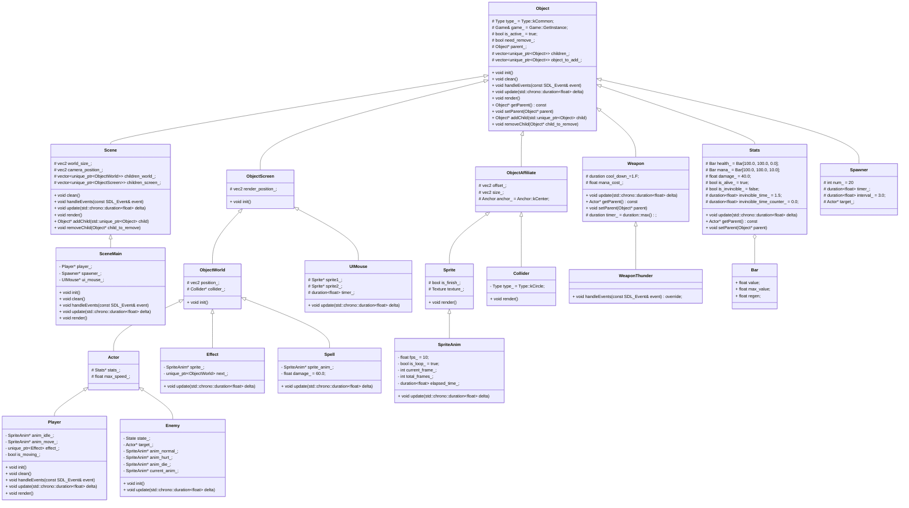

​

# 继承关系图

```mermaid
classDiagram

class Object {
    + void init()
    + void clean()
    + void handleEvents(const SDL_Event& event)
    + void update(std::chrono::duration&lt;float&gt; delta)
    + void render()

    + Object* getParent() const
    + void setParent(Object* parent)

    + Object* addChild(std::unique_ptr&lt;Object&gt; child)
    + void removeChild(Object* child_to_remove)

    # Type type_ = Type::kCommon;
    # Game& game_ = Game::GetInstance;
    # bool is_active_ = true;
    # bool need_remove_;
    # Object* parent_;
    # vector&lt;unique_ptr&lt;Object&gt;&gt; children_;
    # vector&lt;unique_ptr&lt;Object&gt;&gt; object_to_add_;
}

Object <|-- Scene
class Scene {
    + void clean()
    + void handleEvents(const SDL_Event& event)
    + void update(std::chrono::duration&lt;float&gt; delta)
    + void render()

    + Object* addChild(std::unique_ptr&lt;Object&gt; child)
    + void removeChild(Object* child_to_remove)

    # vec2 world_size_;
    # vec2 camera_position_;
    # vector&lt;unique_ptr&lt;ObjectWorld&gt;&gt; children_world_;
    # vector&lt;unique_ptr&lt;ObjectScreen&gt;&gt; children_screen_;
}

Scene <|-- SceneMain
class SceneMain {
    + void init()
    + void clean()
    + void handleEvents(const SDL_Event& event)
    + void update(std::chrono::duration&lt;float&gt; delta)
    + void render()

    - Player* player_;
    - Spawner* spawner_;
    - UIMouse* ui_mouse_;
}

Object <|-- ObjectScreen
class ObjectScreen {
    + void init()

    # vec2 render_position_;
}

ObjectScreen <|-- ObjectWorld
class ObjectWorld {
    + void init()

    # vec2 position_;
    # Collider* collider_;
}

ObjectWorld <|-- Actor
class Actor {
    # Stats* stats_;
    # float max_speed_;
}

Actor <|-- Player
class Player {
    + void init()
    + void clean()
    + void handleEvents(const SDL_Event& event)
    + void update(std::chrono::duration&lt;float&gt; delta)
    + void render()

    - SpriteAnim* anim_idle_;
    - SpriteAnim* anim_move_;
    - unique_ptr&lt;Effect&gt; effect_;
    - bool is_moving_;
}

Actor <|-- Enemy
class Enemy {
    + void init()
    + void update(std::chrono::duration&lt;float&gt; delta)

    - State state_;
    - Actor* target_;
    - SpriteAnim* anim_normal_;
    - SpriteAnim* anim_hurt_;
    - SpriteAnim* anim_die_;
    - SpriteAnim* current_anim_;
}

ObjectWorld <|-- Effect
class Effect {
    + void update(std::chrono::duration&lt;float&gt; delta)

    - SpriteAnim* sprite_;
    - unique_ptr&lt;ObjectWorld&gt; next_;
}

ObjectWorld <|-- Spell
class Spell {
    + void update(std::chrono::duration&lt;float&gt; delta)

    - SpriteAnim* sprite_anim_;
    - float damage_ = 60.0;
}

ObjectScreen <|-- UIMouse
class UIMouse {
    + void update(std::chrono::duration&lt;float&gt; delta)

    # Sprite* sprite1_;
    # Sprite* sprite2_;
    # duration&lt;float&gt; timer_;
}

Object <|-- ObjectAffiliate
class ObjectAffiliate {
    # vec2 offset_;
    # vec2 size_;
    # Anchor anchor_ = Anchor::kCenter;
}

ObjectAffiliate <|-- Sprite
class Sprite {
    + void render()

    # bool is_finish_;
    # Texture texture_;
}

Sprite <|-- SpriteAnim
class SpriteAnim {
    + void update(std::chrono::duration&lt;float&gt; delta)

    - float fps_ = 10;
    - bool is_loop_ = true;
    - int current_frame_;
    - int total_frames_;
    - duration&lt;float&gt; elapsed_time_;
}

ObjectAffiliate <|-- Collider
class Collider {
    + void render()

    - Type type_ = Type::kCircle;
}

Object <|-- Stats
class Stats {
    + void update(std::chrono::duration&lt;float&gt; delta)

    + Actor* getParent() const
    + void setParent(Object* parent)

    # Bar health_ = Bar[100.0, 100.0, 0.0];
    # Bar mana_ = Bar[100.0, 100.0, 10.0];
    # float damage_ = 40.0;
    # bool is_alive_ = true;
    # bool is_invincible_ = false;
    # duration&lt;float&gt; invincible_time_ = 1.5;
    # duration&lt;float&gt; invincible_time_counter_ = 0.0;
}

Object <|-- Weapon
class Weapon {
    + void update(std::chrono::duration&lt;float&gt; delta)

    + Actor* getParent() const
    + void setParent(Object* parent)

    # duration<float> timer_ = duration<float>::max();
    # duration<float> cool_down_=1.F;
    # float mana_cost_;
}

Weapon <|-- WeaponThunder
class WeaponThunder {
    + void handleEvents(const SDL_Event& event) override;
}

Stats o-- Bar
class Bar {
    + float value;
    + float max_value;
    + float regen;
}

Object <|-- Spawner
class Spawner {
    # int num_ = 20
    # duration&lt;float&gt; timer_;
    # duration&lt;float&gt; interval_ = 3.0;
    # Actor* target_;
}

```
